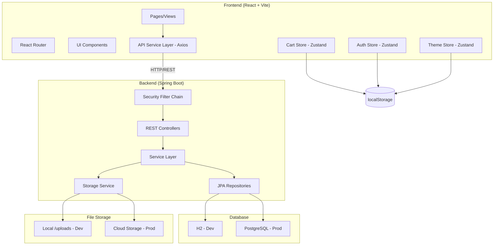
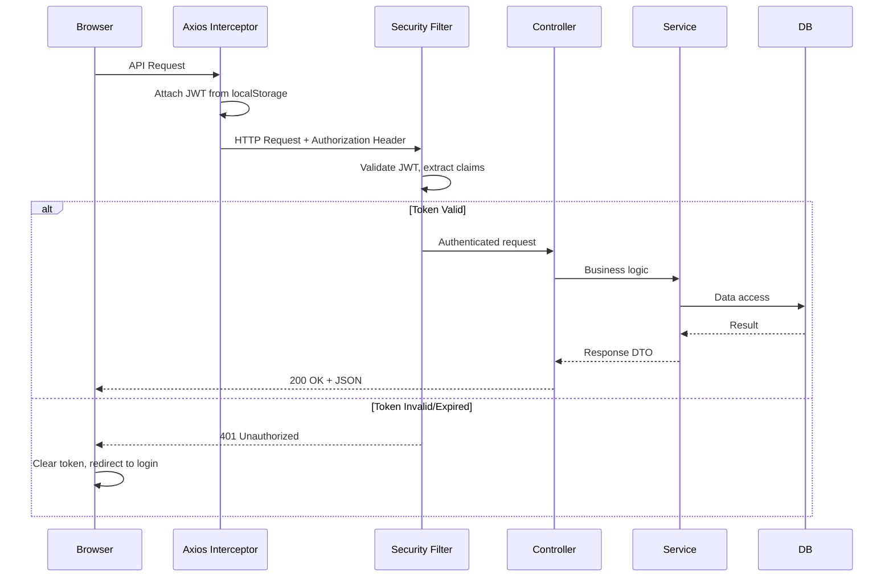
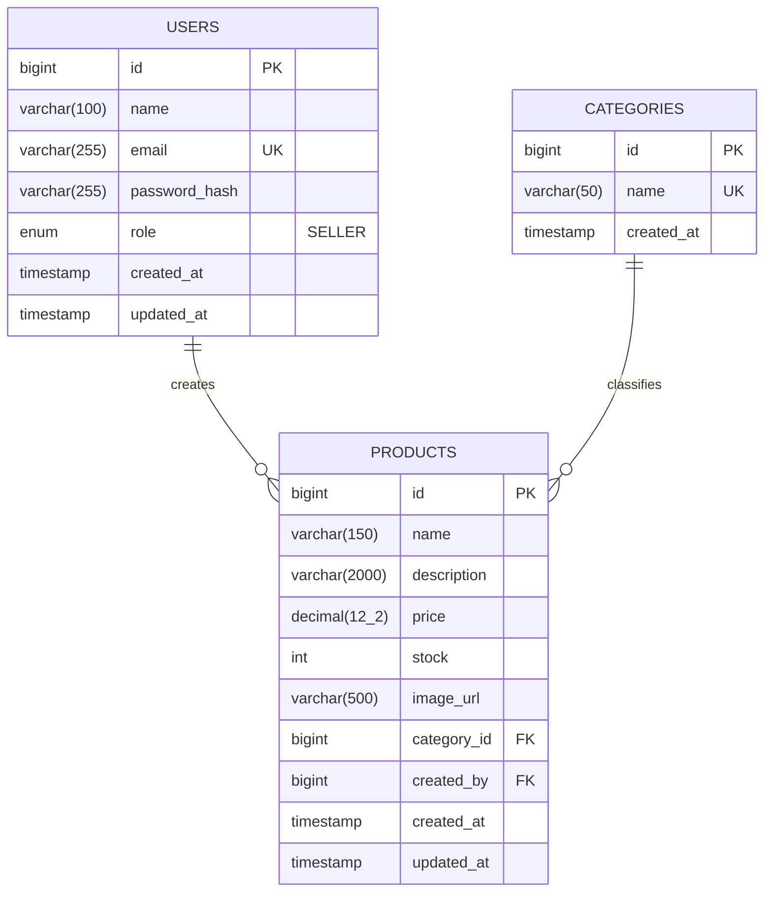

# Design Document: ShopBuilder E-Commerce MVP

## Overview

ShopBuilder is a full-stack e-commerce MVP consisting of a React SPA frontend and a Java Spring Boot REST API backend. The system enables entrepreneurs to register as sellers, manage a product catalog through a protected dashboard, and allows shoppers to browse products and manage a client-side shopping cart.

**Key architectural decisions:**

- **Stateless authentication** via JWT tokens stored in localStorage, with role claims embedded in the token to avoid extra API calls for authorization decisions.
- **Client-side cart** managed entirely by Zustand with localStorage persistence — no backend cart service needed for the MVP.
- **Dual database strategy** using H2 for local development (zero-config) and PostgreSQL for production, with Flyway managing schema migrations.
- **File storage abstraction** allowing local filesystem storage in dev and cloud storage in production via a strategy pattern.
- **Centralized API layer** using a single Axios instance with request/response interceptors for JWT injection and global error handling.

## Architecture

### High-Level System Diagram



### Request Flow



### Frontend Architecture

The frontend follows a layered architecture:

1. **Pages** — Route-level components that compose UI from smaller components and connect to stores.
2. **Components** — Reusable UI elements (ProductCard, CartItem, MetricCard, etc.), each under 150 lines.
3. **Stores** — Zustand stores for auth state, cart state, and theme preference.
4. **Services** — A single Axios instance (`apiService`) with interceptors handling JWT injection and centralized error responses.
5. **Hooks** — Custom React hooks for debounced search, pagination, and form validation.

### Backend Architecture

The backend follows standard Spring Boot layered architecture:

1. **Controllers** — REST endpoints annotated with `@RestController`, handling request/response mapping.
2. **Services** — Business logic layer with `@Service` beans.
3. **Repositories** — Spring Data JPA interfaces extending `JpaRepository`.
4. **Security** — `SecurityFilterChain` bean with JWT authentication filter.
5. **Storage** — Strategy pattern interface (`StorageService`) with local and cloud implementations.
6. **Exception Handling** — Global `@ControllerAdvice` producing consistent error JSON.


## Components and Interfaces

### Frontend Components

#### API Service Layer

```typescript
// src/services/api.ts
import axios, { AxiosInstance, InternalAxiosRequestConfig, AxiosResponse, AxiosError } from 'axios';
import { useAuthStore } from '../stores/authStore';
import { toast } from '../utils/toast';

const apiService: AxiosInstance = axios.create({
  baseURL: import.meta.env.VITE_API_BASE_URL,
  headers: { 'Content-Type': 'application/json' },
});

// Request interceptor: attach JWT
apiService.interceptors.request.use((config: InternalAxiosRequestConfig) => {
  const token = useAuthStore.getState().token;
  if (token) {
    config.headers.Authorization = `Bearer ${token}`;
  }
  return config;
});

// Response interceptor: centralized error handling
apiService.interceptors.response.use(
  (response: AxiosResponse) => response,
  (error: AxiosError<{ error: string; status: number; timestamp: string }>) => {
    if (error.response?.status === 401) {
      useAuthStore.getState().logout();
      toast.error('Session expired. Please log in again.');
      window.location.href = '/login';
    } else if (error.response?.status === 403) {
      toast.error('You do not have permission to perform this action.');
    } else if (error.response?.status === 404) {
      // Let individual components handle 404 via empty states
    } else if (error.response && error.response.status >= 500) {
      toast.error(error.response.data?.error || 'Server error. Please try again later.');
    } else if (!error.response) {
      toast.error('Connection failed. Please check your network.');
    }
    return Promise.reject(error);
  }
);

export default apiService;
```

#### Auth Store

```typescript
// src/stores/authStore.ts
import { create } from 'zustand';

interface User {
  id: number;
  name: string;
  email: string;
  role: 'SELLER';
}

interface AuthState {
  token: string | null;
  user: User | null;
  isAuthenticated: boolean;
  login: (token: string) => void;
  logout: () => void;
}

export const useAuthStore = create<AuthState>((set) => ({
  token: localStorage.getItem('shopbuilder-token'),
  user: JSON.parse(localStorage.getItem('shopbuilder-user') || 'null'),
  isAuthenticated: !!localStorage.getItem('shopbuilder-token'),
  login: (token: string) => {
    const payload = JSON.parse(atob(token.split('.')[1]));
    const user: User = { id: payload.userId, name: payload.name, email: payload.sub, role: payload.role };
    localStorage.setItem('shopbuilder-token', token);
    localStorage.setItem('shopbuilder-user', JSON.stringify(user));
    set({ token, user, isAuthenticated: true });
  },
  logout: () => {
    localStorage.removeItem('shopbuilder-token');
    localStorage.removeItem('shopbuilder-user');
    set({ token: null, user: null, isAuthenticated: false });
  },
}));
```

#### Cart Store

```typescript
// src/stores/cartStore.ts
import { create } from 'zustand';
import { persist, createJSONStorage } from 'zustand/middleware';
import { toast } from '../utils/toast';

interface CartItem {
  productId: number;
  name: string;
  price: number;
  imageUrl: string;
  stock: number;
  quantity: number;
}

interface CartState {
  items: CartItem[];
  addItem: (product: Omit<CartItem, 'quantity'>) => void;
  removeItem: (productId: number) => void;
  updateQuantity: (productId: number, quantity: number) => void;
  clearCart: () => void;
  totalItems: () => number;
  totalPrice: () => number;
}

export const useCartStore = create<CartState>()(
  persist(
    (set, get) => ({
      items: [],
      addItem: (product) => {
        const existing = get().items.find((i) => i.productId === product.productId);
        if (existing) {
          const newQty = Math.min(existing.quantity + 1, product.stock);
          if (newQty === existing.quantity) {
            toast.warning('Maximum stock reached for this product.');
            return;
          }
          set({ items: get().items.map((i) =>
            i.productId === product.productId ? { ...i, quantity: newQty } : i
          )});
        } else {
          set({ items: [...get().items, { ...product, quantity: 1 }] });
        }
      },
      removeItem: (productId) => {
        set({ items: get().items.filter((i) => i.productId !== productId) });
      },
      updateQuantity: (productId, quantity) => {
        const item = get().items.find((i) => i.productId === productId);
        if (!item) return;
        const clamped = Math.max(1, Math.min(quantity, item.stock));
        set({ items: get().items.map((i) =>
          i.productId === productId ? { ...i, quantity: clamped } : i
        )});
      },
      clearCart: () => set({ items: [] }),
      totalItems: () => get().items.reduce((sum, i) => sum + i.quantity, 0),
      totalPrice: () => get().items.reduce((sum, i) => {
        const lineTotal = Math.round(i.price * i.quantity * 100) / 100;
        return sum + lineTotal;
      }, 0),
    }),
    {
      name: 'shopbuilder-cart',
      storage: createJSONStorage(() => localStorage),
    }
  )
);
```

#### Theme Store

```typescript
// src/stores/themeStore.ts
import { create } from 'zustand';

type Theme = 'dark' | 'light';

interface ThemeState {
  theme: Theme;
  toggleTheme: () => void;
}

const getInitialTheme = (): Theme => {
  const stored = localStorage.getItem('shopbuilder-theme') as Theme | null;
  if (stored) return stored;
  if (window.matchMedia('(prefers-color-scheme: dark)').matches) return 'dark';
  return 'light';
};

export const useThemeStore = create<ThemeState>((set) => ({
  theme: getInitialTheme(),
  toggleTheme: () => set((state) => {
    const next: Theme = state.theme === 'dark' ? 'light' : 'dark';
    localStorage.setItem('shopbuilder-theme', next);
    document.documentElement.classList.toggle('dark', next === 'dark');
    return { theme: next };
  }),
}));
```

#### Route Protection

```typescript
// src/components/ProtectedRoute.tsx
import { Navigate, useLocation } from 'react-router-dom';
import { useAuthStore } from '../stores/authStore';
import { toast } from '../utils/toast';

interface Props {
  children: React.ReactNode;
  requiredRole?: string;
}

export const ProtectedRoute = ({ children, requiredRole = 'SELLER' }: Props) => {
  const { isAuthenticated, user, token } = useAuthStore();
  const location = useLocation();

  // Check token expiration (with error handling for malformed tokens)
  if (token) {
    try {
      const payload = JSON.parse(atob(token.split('.')[1]));
      if (payload.exp * 1000 < Date.now()) {
        useAuthStore.getState().logout();
        toast.info('Session expired. Please log in again.');
        return <Navigate to="/login" state={{ from: location }} replace />;
      }
    } catch {
      useAuthStore.getState().logout();
      return <Navigate to="/login" state={{ from: location }} replace />;
    }
  }

  if (!isAuthenticated) {
    return <Navigate to="/login" state={{ from: location }} replace />;
  }

  if (requiredRole && user?.role !== requiredRole) {
    toast.error('Insufficient permissions.');
    return <Navigate to="/products" replace />;
  }

  return <>{children}</>;
};
```

### Backend Components

#### Security Configuration

```java
// src/main/java/com/shopbuilder/config/SecurityConfig.java
@Configuration
@EnableWebSecurity
public class SecurityConfig {

    @Bean
    public SecurityFilterChain filterChain(HttpSecurity http, JwtAuthFilter jwtAuthFilter) throws Exception {
        return http
            .csrf(csrf -> csrf.disable())
            .cors(Customizer.withDefaults())
            .sessionManagement(sm -> sm.sessionCreationPolicy(SessionCreationPolicy.STATELESS))
            .authorizeHttpRequests(auth -> auth
                .requestMatchers("/api/auth/**").permitAll()
                .requestMatchers(HttpMethod.GET, "/api/products/**").permitAll()
                .requestMatchers(HttpMethod.GET, "/api/categories").permitAll()
                .requestMatchers("/uploads/**").permitAll()
                .requestMatchers("/api/products/**").authenticated()
                .anyRequest().authenticated()
            )
            .addFilterBefore(jwtAuthFilter, UsernamePasswordAuthenticationFilter.class)
            .build();
    }

    @Bean
    public CorsConfigurationSource corsConfigurationSource(
            @Value("${app.cors.allowed-origin}") String allowedOrigin) {
        CorsConfiguration config = new CorsConfiguration();
        config.setAllowedOrigins(List.of(allowedOrigin));
        config.setAllowedMethods(List.of("GET", "POST", "PUT", "DELETE", "OPTIONS"));
        config.setAllowedHeaders(List.of("Authorization", "Content-Type", "Accept"));
        config.setMaxAge(3600L);
        UrlBasedCorsConfigurationSource source = new UrlBasedCorsConfigurationSource();
        source.registerCorsConfiguration("/**", config);
        return source;
    }
}
```

#### Rate Limiting (Login Brute-Force Protection)

```java
// src/main/java/com/shopbuilder/security/RateLimitFilter.java
@Component
public class RateLimitFilter extends OncePerRequestFilter {

    // Map of IP -> Bucket for rate limiting
    private final ConcurrentHashMap<String, Bucket> buckets = new ConcurrentHashMap<>();

    @Override
    protected void doFilterInternal(HttpServletRequest request, HttpServletResponse response,
                                     FilterChain filterChain) throws ServletException, IOException {
        if (request.getRequestURI().equals("/api/auth/login") && request.getMethod().equals("POST")) {
            String ip = request.getRemoteAddr();
            Bucket bucket = buckets.computeIfAbsent(ip, k -> createBucket());
            if (!bucket.tryConsume(1)) {
                response.setStatus(429);
                response.setContentType("application/json");
                response.getWriter().write(
                    "{\"error\":\"Too many login attempts. Please try again later.\",\"status\":429,\"timestamp\":\""
                    + Instant.now().toString() + "\"}");
                return;
            }
        }
        filterChain.doFilter(request, response);
    }

    private Bucket createBucket() {
        // 10 attempts per 5 minutes
        Bandwidth limit = Bandwidth.classic(10, Refill.intervally(10, Duration.ofMinutes(5)));
        return Bucket.builder().addLimit(limit).build();
    }
}
```

> **Dependency:** Add `com.bucket4j:bucket4j-core:8.10.1` to `pom.xml`. The `RateLimitFilter` is registered before `JwtAuthFilter` in the filter chain and applies exclusively to `POST /api/auth/login`. Returns HTTP 429 with the standard error JSON shape when the limit (10 attempts per IP per 5 minutes) is exceeded.

#### JWT Service

```java
// src/main/java/com/shopbuilder/security/JwtService.java
@Service
public class JwtService {

    @Value("${app.jwt.secret}")
    private String secret;

    @Value("${app.jwt.expiration-ms}")
    private long expirationMs;

    public String generateToken(User user) {
        return Jwts.builder()
            .subject(user.getEmail())
            .claim("userId", user.getId())
            .claim("name", user.getName())
            .claim("role", user.getRole().name())
            .issuedAt(new Date())
            .expiration(new Date(System.currentTimeMillis() + expirationMs))
            .signWith(getSigningKey())
            .compact();
    }

    public Claims extractClaims(String token) {
        return Jwts.parser()
            .verifyWith(getSigningKey())
            .build()
            .parseSignedClaims(token)
            .getPayload();
    }

    public boolean isTokenValid(String token) {
        try {
            Claims claims = extractClaims(token);
            return claims.getExpiration().after(new Date());
        } catch (JwtException e) {
            return false;
        }
    }

    private SecretKey getSigningKey() {
        return Keys.hmacShaKeyFor(Decoders.BASE64.decode(secret));
    }
}
```

#### Global Exception Handler

```java
// src/main/java/com/shopbuilder/exception/GlobalExceptionHandler.java
@ControllerAdvice
public class GlobalExceptionHandler {

    @ExceptionHandler(ResourceNotFoundException.class)
    public ResponseEntity<ErrorResponse> handleNotFound(ResourceNotFoundException ex) {
        return ResponseEntity.status(404).body(new ErrorResponse(ex.getMessage(), 404));
    }

    @ExceptionHandler(AccessDeniedException.class)
    public ResponseEntity<ErrorResponse> handleForbidden(AccessDeniedException ex) {
        return ResponseEntity.status(403).body(new ErrorResponse("Insufficient permissions", 403));
    }

    @ExceptionHandler(DuplicateEmailException.class)
    public ResponseEntity<ErrorResponse> handleDuplicateEmail(DuplicateEmailException ex) {
        return ResponseEntity.status(409).body(new ErrorResponse(ex.getMessage(), 409));
    }

    @ExceptionHandler(MethodArgumentNotValidException.class)
    public ResponseEntity<ErrorResponse> handleValidation(MethodArgumentNotValidException ex) {
        String message = ex.getBindingResult().getFieldErrors().stream()
            .map(e -> e.getField() + ": " + e.getDefaultMessage())
            .collect(Collectors.joining(", "));
        return ResponseEntity.status(400).body(new ErrorResponse(message, 400));
    }

    @ExceptionHandler(Exception.class)
    public ResponseEntity<ErrorResponse> handleGeneral(Exception ex) {
        return ResponseEntity.status(500).body(new ErrorResponse("Internal server error", 500));
    }
}

public record ErrorResponse(String error, int status, String timestamp) {
    public ErrorResponse(String error, int status) {
        this(error, status, Instant.now().toString());
    }
}
```

#### Storage Service Interface

```java
// src/main/java/com/shopbuilder/storage/StorageService.java
public interface StorageService {
    String store(MultipartFile file);
    void delete(String filename);
}

// Local implementation for dev
@Service
@Profile("dev")
public class LocalStorageService implements StorageService {
    @Value("${app.storage.upload-dir}")
    private String uploadDir;

    @Value("${app.storage.base-url}")
    private String baseUrl;

    @Override
    public String store(MultipartFile file) {
        String filename = UUID.randomUUID() + "_" + file.getOriginalFilename();
        Path target = Path.of(uploadDir).resolve(filename);
        Files.copy(file.getInputStream(), target, StandardCopyOption.REPLACE_EXISTING);
        return baseUrl + "/uploads/" + filename;
    }

    @Override
    public void delete(String filename) {
        Path target = Path.of(uploadDir).resolve(filename);
        Files.deleteIfExists(target);
    }
}
```

#### Auth Controller

```java
// src/main/java/com/shopbuilder/controller/AuthController.java
@RestController
@RequestMapping("/api/auth")
public class AuthController {

    private final AuthService authService;

    @PostMapping("/register")
    public ResponseEntity<AuthResponse> register(@Valid @RequestBody RegisterRequest request) {
        AuthResponse response = authService.register(request);
        return ResponseEntity.status(201).body(response);
    }

    @PostMapping("/login")
    public ResponseEntity<AuthResponse> login(@Valid @RequestBody LoginRequest request) {
        AuthResponse response = authService.login(request);
        return ResponseEntity.ok(response);
    }
}

public record RegisterRequest(
    @NotBlank String name,
    @Email @NotBlank String email,
    @Pattern(
        regexp = "^(?=.*\\d).{8,}$",
        message = "Password must be at least 8 characters and contain at least one digit"
    ) String password
) {}

public record LoginRequest(
    @Email @NotBlank String email,
    @NotBlank String password
) {}

public record AuthResponse(String token) {}
```

#### Product Controller

```java
// src/main/java/com/shopbuilder/controller/ProductController.java
@RestController
@RequestMapping("/api/products")
public class ProductController {

    private final ProductService productService;

    @GetMapping
    public ResponseEntity<PaginatedResponse<ProductDto>> getProducts(
            @RequestParam(defaultValue = "0") int page,
            @RequestParam(defaultValue = "12") @Max(100) int size,
            @RequestParam(required = false) @Size(max = 255) String search,
            @RequestParam(required = false) String category) {
        return ResponseEntity.ok(productService.getProducts(page, size, search, category));
    }

    @GetMapping("/{id}")
    public ResponseEntity<ProductDto> getProduct(@PathVariable Long id) {
        return ResponseEntity.ok(productService.getProduct(id));
    }

    @PostMapping(consumes = MediaType.MULTIPART_FORM_DATA_VALUE)
    public ResponseEntity<ProductDto> createProduct(
            @Valid @RequestPart("product") CreateProductRequest request,
            @RequestPart(value = "image", required = false) MultipartFile image,
            @AuthenticationPrincipal UserDetails userDetails) {
        return ResponseEntity.status(201)
            .body(productService.createProduct(request, image, userDetails.getUsername()));
    }

    @PutMapping(value = "/{id}", consumes = MediaType.MULTIPART_FORM_DATA_VALUE)
    public ResponseEntity<ProductDto> updateProduct(
            @PathVariable Long id,
            @Valid @RequestPart("product") UpdateProductRequest request,
            @RequestPart(value = "image", required = false) MultipartFile image,
            @AuthenticationPrincipal UserDetails userDetails) {
        return ResponseEntity.ok(productService.updateProduct(id, request, image, userDetails.getUsername()));
    }

    @DeleteMapping("/{id}")
    public ResponseEntity<Void> deleteProduct(
            @PathVariable Long id,
            @AuthenticationPrincipal UserDetails userDetails) {
        productService.deleteProduct(id, userDetails.getUsername());
        return ResponseEntity.noContent().build();
    }
}
```

### Frontend Route Structure

```typescript
// src/App.tsx - Route definitions
const routes = [
  // Public routes
  { path: '/', element: <Navigate to="/products" /> },
  { path: '/products', element: <CatalogPage /> },
  { path: '/products/:id', element: <ProductDetailPage /> },
  { path: '/cart', element: <CartPage /> },
  { path: '/login', element: <LoginPage /> },
  { path: '/register', element: <RegisterPage /> },

  // Protected routes
  {
    path: '/dashboard',
    element: <ProtectedRoute><DashboardLayout /></ProtectedRoute>,
    children: [
      { index: true, element: <DashboardOverview /> },
      { path: 'products', element: <ProductListPage /> },
      { path: 'products/new', element: <ProductFormPage /> },
      { path: 'products/:id/edit', element: <ProductFormPage /> },
    ],
  },
];
```


## Data Models

### Database Schema



### JPA Entities

```java
// User entity
@Entity
@Table(name = "users")
@EntityListeners(AuditingEntityListener.class)
public class User {
    @Id @GeneratedValue(strategy = GenerationType.IDENTITY)
    private Long id;

    @Column(nullable = false, length = 100)
    private String name;

    @Column(nullable = false, unique = true)
    private String email;

    @Column(name = "password_hash", nullable = false)
    private String passwordHash;

    @Enumerated(EnumType.STRING)
    @Column(nullable = false)
    private Role role = Role.SELLER;

    @CreatedDate
    @Column(name = "created_at", updatable = false)
    private Instant createdAt;

    @LastModifiedDate
    @Column(name = "updated_at")
    private Instant updatedAt;
}

public enum Role { SELLER }

// Category entity
@Entity
@Table(name = "categories")
@EntityListeners(AuditingEntityListener.class)
public class Category {
    @Id @GeneratedValue(strategy = GenerationType.IDENTITY)
    private Long id;

    @Column(nullable = false, unique = true, length = 50)
    private String name;

    @CreatedDate
    @Column(name = "created_at", updatable = false)
    private Instant createdAt;
}

// Product entity
@Entity
@Table(name = "products")
@EntityListeners(AuditingEntityListener.class)
public class Product {
    @Id @GeneratedValue(strategy = GenerationType.IDENTITY)
    private Long id;

    @Column(nullable = false, length = 150)
    private String name;

    @Column(nullable = false, length = 2000)
    private String description;

    @Column(nullable = false, precision = 12, scale = 2)
    private BigDecimal price;

    @Column(nullable = false)
    private Integer stock;

    @Column(name = "image_url", length = 500)
    private String imageUrl;

    @ManyToOne(fetch = FetchType.LAZY)
    @JoinColumn(name = "category_id", nullable = false)
    private Category category;

    @ManyToOne(fetch = FetchType.LAZY)
    @JoinColumn(name = "created_by", nullable = false)
    private User createdBy;

    @CreatedDate
    @Column(name = "created_at", updatable = false)
    private Instant createdAt;

    @LastModifiedDate
    @Column(name = "updated_at")
    private Instant updatedAt;
}
```

> **Note:** The main application class must be annotated with `@EnableJpaAuditing` to activate Spring Data JPA auditing for `@CreatedDate` and `@LastModifiedDate`.

### DTOs and Response Shapes

```java
// Paginated response wrapper
public record PaginatedResponse<T>(
    List<T> content,
    int totalPages,
    long totalElements,
    int currentPage
) {}

// Product DTO
public record ProductDto(
    Long id,
    String name,
    String description,
    BigDecimal price,
    Integer stock,
    String imageUrl,
    String category,
    Long categoryId,
    Long createdBy,
    Instant createdAt
) {}

// Create/Update request DTOs
public record CreateProductRequest(
    @NotBlank @Size(max = 150) String name,
    @NotBlank @Size(max = 2000) String description,
    @DecimalMin("0.01") @DecimalMax("999999999.99") BigDecimal price,
    @Min(0) @Max(999999) Integer stock,
    @NotNull Long categoryId,
    String imageUrl  // optional direct URL
) {}

public record UpdateProductRequest(
    @NotBlank @Size(max = 150) String name,
    @NotBlank @Size(max = 2000) String description,
    @DecimalMin("0.01") @DecimalMax("999999999.99") BigDecimal price,
    @Min(0) @Max(999999) Integer stock,
    @NotNull Long categoryId,
    String imageUrl
) {}
```

### Flyway Migration (V1)

```sql
-- V1__initial_schema.sql
CREATE TABLE users (
    id BIGINT GENERATED ALWAYS AS IDENTITY PRIMARY KEY,
    name VARCHAR(100) NOT NULL,
    email VARCHAR(255) NOT NULL UNIQUE,
    password_hash VARCHAR(255) NOT NULL,
    role VARCHAR(20) NOT NULL DEFAULT 'SELLER',
    created_at TIMESTAMP NOT NULL DEFAULT CURRENT_TIMESTAMP,
    updated_at TIMESTAMP NOT NULL DEFAULT CURRENT_TIMESTAMP
);

CREATE TABLE categories (
    id BIGINT GENERATED ALWAYS AS IDENTITY PRIMARY KEY,
    name VARCHAR(50) NOT NULL UNIQUE,
    created_at TIMESTAMP NOT NULL DEFAULT CURRENT_TIMESTAMP
);

CREATE TABLE products (
    id BIGINT GENERATED ALWAYS AS IDENTITY PRIMARY KEY,
    name VARCHAR(150) NOT NULL,
    description VARCHAR(2000) NOT NULL,
    price DECIMAL(12, 2) NOT NULL CHECK (price >= 0.01),
    stock INT NOT NULL DEFAULT 0 CHECK (stock >= 0),
    image_url VARCHAR(500),
    category_id BIGINT NOT NULL REFERENCES categories(id),
    created_by BIGINT NOT NULL REFERENCES users(id),
    created_at TIMESTAMP NOT NULL DEFAULT CURRENT_TIMESTAMP,
    updated_at TIMESTAMP NOT NULL DEFAULT CURRENT_TIMESTAMP
);

CREATE INDEX idx_products_category ON products(category_id);
CREATE INDEX idx_products_created_by ON products(created_by);
CREATE INDEX idx_products_name ON products(name);
```

### Database Seeding

```java
// src/main/java/com/shopbuilder/config/DataSeeder.java
@Component
@Profile("dev")
public class DataSeeder implements CommandLineRunner {

    private final UserRepository userRepository;
    private final CategoryRepository categoryRepository;
    private final ProductRepository productRepository;
    private final PasswordEncoder passwordEncoder;

    @Override
    public void run(String... args) {
        if (categoryRepository.count() > 0) return; // Skip if already seeded

        // Create default seller
        User seller = new User();
        seller.setName("Demo Seller");
        seller.setEmail("seller@shopbuilder.dev");
        seller.setPasswordHash(passwordEncoder.encode("seller123"));
        seller.setRole(Role.SELLER);
        userRepository.save(seller);

        // Create categories
        Category electronics = categoryRepository.save(new Category("electronics"));
        Category clothing = categoryRepository.save(new Category("clothing"));
        Category home = categoryRepository.save(new Category("home"));

        // Create 10 sample products (at least 3 per category)
        // Products distributed: 4 electronics, 3 clothing, 3 home
        // Each with placehold.co images, realistic names, prices 1.00-999.99
    }
}
```

### Application Properties Structure

```properties
# application.properties (shared)
app.cors.allowed-origin=${APP_CORS_ALLOWED_ORIGIN}
app.jwt.secret=${JWT_SECRET}
app.jwt.expiration-ms=28800000
app.storage.provider=${STORAGE_PROVIDER:local}
spring.servlet.multipart.max-file-size=5MB
spring.servlet.multipart.max-request-size=5MB

# application-dev.properties
spring.datasource.url=jdbc:h2:mem:shopbuilder;DB_CLOSE_DELAY=-1
spring.datasource.driver-class-name=org.h2.Driver
spring.datasource.username=sa
spring.datasource.password=
spring.jpa.hibernate.ddl-auto=create-drop
spring.flyway.enabled=false
app.jwt.expiration-ms=86400000
app.cors.allowed-origin=http://localhost:5173
app.storage.upload-dir=./uploads
app.storage.base-url=http://localhost:8080

# application-prod.properties
spring.datasource.url=${DB_URL}
spring.datasource.username=${DB_USERNAME}
spring.datasource.password=${DB_PASSWORD}
spring.jpa.hibernate.ddl-auto=validate
spring.flyway.enabled=true
app.jwt.expiration-ms=28800000
app.storage.provider=cloud
```


## Correctness Properties

*A property is a characteristic or behavior that should hold true across all valid executions of a system — essentially, a formal statement about what the system should do. Properties serve as the bridge between human-readable specifications and machine-verifiable correctness guarantees.*

### Property 1: JWT token contains correct claims

*For any* valid user with a name, email, and role, generating a JWT token and then extracting its claims should yield the same email as subject, the same role, and a valid userId matching the user's ID.

**Validates: Requirements 1.1, 1.2, 2.1**

### Property 2: Password validation correctly classifies inputs

*For any* string, the password validation function should accept it if and only if it has length >= 8 and contains at least one digit character. All other strings should be rejected.

**Validates: Requirements 1.7**

### Property 3: Email validation correctly classifies inputs

*For any* string, the email validation function should accept it if and only if it matches a well-formed email pattern (non-empty, contains @ with valid local and domain parts). Empty strings and malformed patterns should be rejected.

**Validates: Requirements 2.7**

### Property 4: Axios interceptor attaches JWT to requests

*For any* outgoing API request configuration, if a JWT token exists in the auth store, the request interceptor should produce a configuration with an Authorization header set to "Bearer {token}". If no token exists, the Authorization header should be absent.

**Validates: Requirements 2.3**

### Property 5: Route access control decision

*For any* route path and authentication state (token presence, token expiration, role claim), the route guard should: grant access if the token is present, not expired, and contains the required role; redirect to login if no token or expired token; redirect to catalog if token is valid but lacks the required role.

**Validates: Requirements 3.1, 3.2, 3.3, 3.7**

### Property 6: Error responses have consistent shape

*For any* exception thrown within the application, the global exception handler should produce a JSON response containing exactly three fields: "error" (non-empty string), "status" (integer matching HTTP status code), and "timestamp" (valid ISO-8601 string).

**Validates: Requirements 3.6**

### Property 7: Product search filter correctness

*For any* set of products and any search string, the filtered results should contain only products whose name contains the search string (case-insensitive partial match). When a category filter is also applied, results should additionally belong to that category. No matching product should be excluded.

**Validates: Requirements 5.6**

### Property 8: Cart add item behavior

*For any* product not in the cart, adding it should result in the cart containing that product with quantity 1. *For any* product already in the cart with quantity < stock, adding it again should increment the quantity by exactly 1. *For any* product already in the cart with quantity == stock, adding it should leave the quantity unchanged.

**Validates: Requirements 7.1, 7.2, 7.7**

### Property 9: Cart quantity clamping

*For any* cart item with stock S and any requested quantity Q (integer), updating the quantity should result in a stored quantity equal to max(1, min(Q, S)). Values below 1 are clamped to 1, values above stock are clamped to stock.

**Validates: Requirements 7.3, 7.10**

### Property 10: Cart remove item

*For any* cart containing N items and any product present in the cart, removing that product should result in a cart of N-1 items where the removed product is no longer present, and all other items remain unchanged.

**Validates: Requirements 7.4**

### Property 11: Cart persistence round-trip

*For any* valid cart state (list of items with productId, name, price, imageUrl, stock, quantity), serializing to JSON via the Zustand persist middleware and then deserializing should produce an equivalent cart state with all fields preserved.

**Validates: Requirements 7.5, 7.6**

### Property 12: Cart total computation

*For any* list of cart items, totalItems() should equal the sum of all item quantities, and totalPrice() should equal the sum of each item's (price × quantity) rounded to 2 decimal places per line item before summing.

**Validates: Requirements 7.8, 8.1**

### Property 13: Currency formatting

*For any* non-negative number, the currency format function should produce a string that starts with a currency symbol, contains exactly one decimal point, and has exactly 2 digits after the decimal point.

**Validates: Requirements 8.2**

### Property 14: Ownership enforcement

*For any* product and any authenticated user, the system should allow modification (update/delete) only if the product's createdBy matches the authenticated user's ID. All other attempts should be rejected with a 403 status. Additionally, when listing products for a seller, only products where createdBy matches the seller's ID should be returned.

**Validates: Requirements 10.1, 11.6, 16.12**

### Property 15: Product data validation

*For any* product creation/update request, the system should accept it if and only if: name is 1-150 characters, description is 1-2000 characters, price is between 0.01 and 999,999,999.99, stock is an integer between 0 and 999,999, and categoryId references an existing category. Requests violating any constraint should be rejected with a 400 error.

**Validates: Requirements 11.1, 11.5**

### Property 16: File upload validation

*For any* uploaded file, the system should accept it if and only if its content type is one of JPEG, PNG, or WebP AND its size is <= 5 MB. The returned URL should start with "http://" or "https://". Files violating either constraint should be rejected with an error indicating which constraint was violated.

**Validates: Requirements 11.3, 11.10, 20.4**

### Property 17: Unique filename generation

*For any* two file uploads (even with identical original filenames), the storage service should generate distinct filenames, ensuring no collisions.

**Validates: Requirements 20.6**

### Property 18: Login rate limiting

*For any* IP address making login requests, the system should allow up to 10 requests within a 5-minute window. The 11th request within the same window should be rejected with HTTP 429. After the 5-minute window resets, requests should be allowed again.

**Validates: Security best practice for Requirements 2.1, 2.2**

## Error Handling

### Backend Error Strategy

All errors are handled by a global `@ControllerAdvice` exception handler that produces a consistent JSON response shape:

```json
{
  "error": "Human-readable error message",
  "status": 404,
  "timestamp": "2024-01-15T10:30:00Z"
}
```

| HTTP Status | Scenario | Exception Class |
|-------------|----------|-----------------|
| 400 | Validation failure (invalid fields) | `MethodArgumentNotValidException` |
| 401 | Invalid/expired JWT token | `AuthenticationException` (Spring Security) |
| 403 | Insufficient permissions / not resource owner | `AccessDeniedException` |
| 404 | Resource not found | `ResourceNotFoundException` (custom) |
| 409 | Duplicate email on registration | `DuplicateEmailException` (custom) |
| 413 | File too large (> 5MB) | `MaxUploadSizeExceededException` |
| 415 | Unsupported file type | `UnsupportedMediaTypeException` (custom) |
| 429 | Too many login attempts (rate limited) | Handled by `RateLimitFilter` |
| 500 | Unexpected server error | `Exception` (catch-all) |

### Frontend Error Strategy

The Axios response interceptor handles errors centrally:

| Status | Action |
|--------|--------|
| 401 | Clear token from localStorage, redirect to `/login`, show "Session expired" toast |
| 403 | Show "Insufficient permissions" toast, no redirect |
| 404 | Pass through to component — component renders appropriate empty state |
| 5xx | Show server error toast with message from response body |
| Network error | Show "Connection failed" toast |

**Design decisions:**
- 404 errors are NOT handled by the interceptor because each page has a unique empty state design.
- Components never handle raw HTTP errors — they only react to the data/error state from their API calls.
- Toast notifications use a utility module (`src/utils/toast.ts`) wrapping a lightweight toast library (e.g., react-hot-toast or sonner).

### Validation Strategy

**Frontend (pre-submission):**
- Real-time inline validation as user leaves each field (onBlur)
- Password: min 8 chars, at least 1 digit
- Email: non-empty, valid format
- Product name: 1-150 chars
- Product description: 1-2000 chars
- Product price: 0.01 - 999,999,999.99
- Product stock: 0 - 999,999 integer
- Image file: JPEG/PNG/WebP, max 5MB

**Backend (server-side):**
- Jakarta Bean Validation annotations on request DTOs (`@NotBlank`, `@Size`, `@DecimalMin`, `@DecimalMax`, `@Min`, `@Max`, `@Email`)
- Custom validators where needed (e.g., file type check)
- All validation errors collected and returned in a single 400 response

## Testing Strategy

### Testing Framework Selection

**Backend (Java):**
- JUnit 5 for unit and integration tests
- jqwik for property-based testing (Java PBT library)
- Mockito for mocking dependencies
- Spring Boot Test + MockMvc for controller integration tests
- H2 in-memory database for repository tests

**Frontend (TypeScript):**
- Vitest as the test runner (Vite-native, fast)
- fast-check for property-based testing (TypeScript PBT library)
- React Testing Library for component tests
- MSW (Mock Service Worker) for API mocking

### Test Categories

#### Property-Based Tests (minimum 100 iterations each)

Each correctness property from the design document maps to one property-based test:

| Property | Backend/Frontend | Library | Key Generators |
|----------|-----------------|---------|----------------|
| P1: JWT claims | Backend | jqwik | Random users (name, email, role) |
| P2: Password validation | Frontend | fast-check | Arbitrary strings, strings with/without digits |
| P3: Email validation | Frontend | fast-check | Arbitrary strings, valid/invalid email patterns |
| P4: JWT interceptor | Frontend | fast-check | Request configs × optional tokens |
| P5: Route access control | Frontend | fast-check | Route paths × auth states (token/no-token/expired/wrong-role) |
| P6: Error response shape | Backend | jqwik | Various exception types |
| P7: Product search filter | Backend | jqwik | Random product lists × search strings × categories |
| P8: Cart add behavior | Frontend | fast-check | Random products × cart states |
| P9: Cart quantity clamping | Frontend | fast-check | Random quantities × stock values |
| P10: Cart remove | Frontend | fast-check | Random carts × item selection |
| P11: Cart persistence | Frontend | fast-check | Random cart states (serialization round-trip) |
| P12: Cart totals | Frontend | fast-check | Random item lists with prices/quantities |
| P13: Currency formatting | Frontend | fast-check | Random non-negative numbers |
| P14: Ownership enforcement | Backend | jqwik | Random products × users |
| P15: Product validation | Backend | jqwik | Random product data (valid and invalid) |
| P16: File upload validation | Backend | jqwik | Random file metadata (type, size) |
| P17: Unique filenames | Backend | jqwik | Pairs of uploads with same/different names |
| P18: Login rate limiting | Backend | jqwik | Sequences of login requests per IP × time windows |

**Tag format:** Each test is tagged with:
```
Feature: ecommerce-mvp, Property {N}: {property title}
```

#### Unit Tests (Example-Based)

- Auth flow: registration success, login success, duplicate email error, invalid credentials
- Product CRUD: create, read, update, delete with valid data
- UI components: rendering with various props, loading states, empty states
- Theme toggle: initial detection, persistence, toggle behavior
- Debounce: verify timing behavior with fake timers

#### Integration Tests

- Full auth flow: register → login → access protected route → logout
- Product lifecycle: create → list → update → delete
- File upload: valid file → stored → accessible via URL
- CORS: verify headers from allowed/disallowed origins
- Database seeding: verify seed data on fresh start, skip on restart
- Pagination: verify page navigation with various page sizes

#### Smoke Tests

- Application starts successfully with required env vars
- Application fails to start with missing env vars
- Database connectivity check per profile
- No inline styles in component files (lint rule)
- All component files under 150 lines
- No direct fetch/axios imports outside api.ts

### Test Configuration

```typescript
// vitest.config.ts (Frontend)
export default defineConfig({
  test: {
    environment: 'jsdom',
    globals: true,
    setupFiles: ['./src/test/setup.ts'],
  },
});
```

```xml
<!-- pom.xml (Backend) - jqwik dependency -->
<dependency>
    <groupId>net.jqwik</groupId>
    <artifactId>jqwik</artifactId>
    <version>1.8.5</version>
    <scope>test</scope>
</dependency>
```

### Coverage Goals

- Backend service layer: 90%+ line coverage
- Frontend stores (cart, auth, theme): 95%+ line coverage
- Frontend components: 80%+ line coverage
- All correctness properties passing with 100+ iterations

